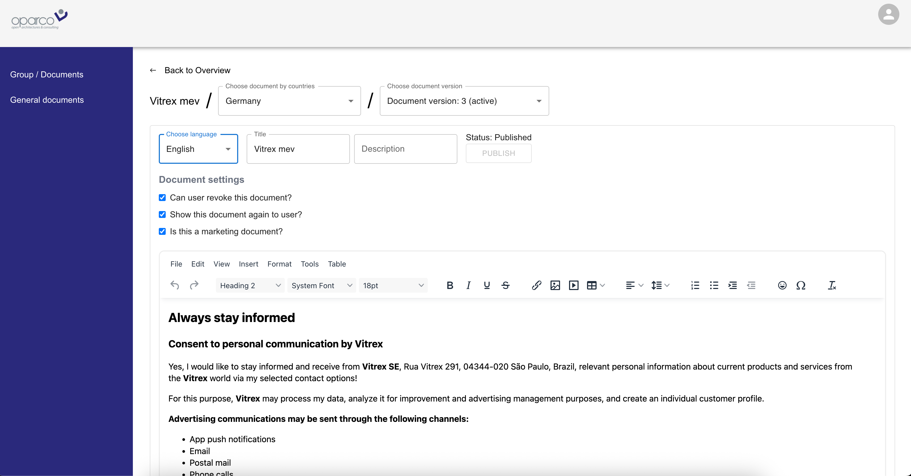
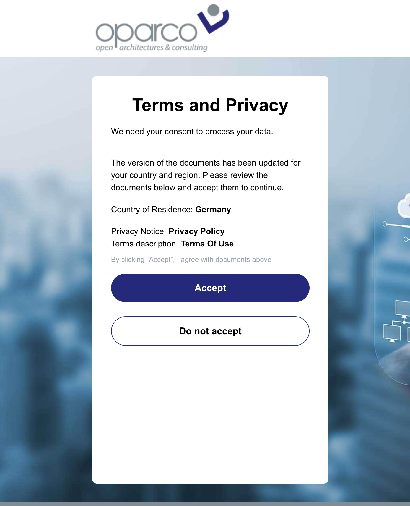
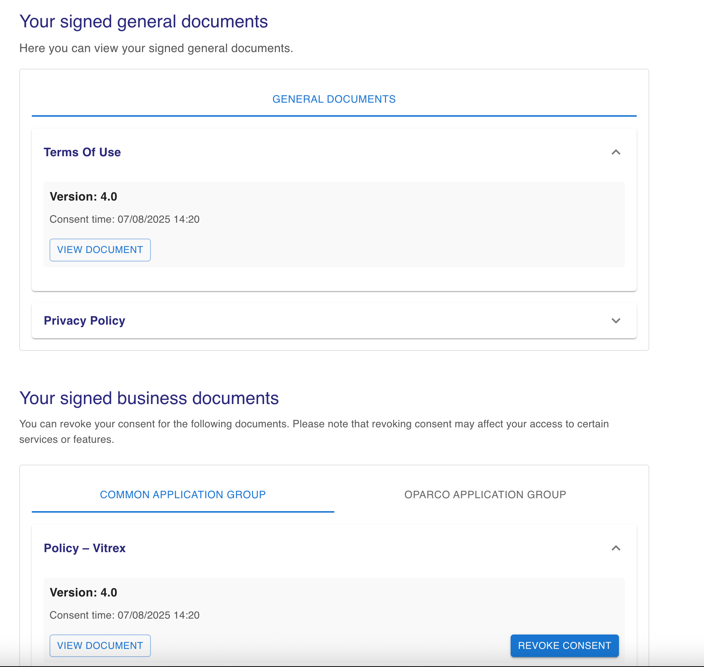

## How It Works

This project consists of three main applications that work together to manage user consent for various document types:

### 1. Admin Dashboard Application

The admin dashboard is designed for administrators and provides the following features:

- **Configure Consent Documents**: Create, edit, and organize consent documents that users must review and sign.
- **Track Document Versions**: Maintain a version history for each document, allowing administrators to see changes over time and ensure compliance.

- 

- **Define Scopes**: Assign specific scopes or permissions to each document, which will later be used to enrich user tokens.
- **Manage Document Types**: Handle three categories of documents:
    - **General Documents**: Essential for basic application access; users must accept these to use the platform.
    - **Business Documents**: Related to business operations, such as service agreements or data processing addendums.
    - **Marketing Documents**: Cover marketing communications and promotional consent.

Administrators can also view analytics on user consent status and receive notifications when documents require updates.

### 2. User Profile Application

The user profile application is intended for end users and offers the following capabilities:

- **View Signed Documents**: Users can see a list of all consent documents they have signed, including document versions and timestamps.
- **Revoke or Delete Consents**: Users may revoke or delete their consent for business and marketing documents at any time. General consent is mandatory and cannot be deleted.
- **Receive Notifications**: Users are notified when new documents require their consent or when existing documents are updated.
- **Audit Trail**: Users can access a history of their consent actions for transparency and compliance.

### 3. Backend Application

The backend application acts as the core orchestrator for the consent process:

- **Document Management**: Stores and manages all document configurations, versions, and associated scopes.
- **User Consent Handling**: Processes user actions such as granting, revoking, or updating consent, and ensures that the correct scopes are applied to user tokens.
- **Integration with Auth0**: Coordinates with Auth0 Actions to enforce consent requirements during authentication and token issuance.
- **Audit Logging**: Maintains a secure log of all consent-related activities for compliance and troubleshooting.

# auth0-consent-server-actions

This project provides a set of Auth0 Actions to manage user consent and token enrichment for various document types in your application.

## Requirements

- Node.js (v18 or later recommended)
- Auth0 account with configured Actions
- Access to Auth0 Dashboard with permissions to create and manage Actions
- Auth0 Application (API) for Machine-to-Machine (M2M) authentication
- Environment variables for Auth0 domain, client ID, and client secret

## Usage

### 1. Obtain M2M Token

First, you need to obtain a Machine-to-Machine (M2M) token from Auth0. This token is required to authenticate and authorize subsequent actions.

### 2. Consent Actions Flow

The consent process consists of several steps, each handled by a specific action:

#### a. General Consent

- Use the **General Consent Action** to request and record user consent for general application usage.

#### b. Document Consent

- Use the **Document Consent Action** to request and record user consent for accessing or processing specific documents.

#### c. Marketing Documents Consent

- Use the **Marketing Documents Consent Action** to request and record user consent for marketing-related documents.

### 3. Enrich Token with Scopes

After all required consents (general, document, and marketing) are successfully obtained, use the **Enrich Token Action**. This action will enrich the user's token with the appropriate scopes based on the consents provided.

## Summary

1. Get M2M token from Auth0.
2. Run General Consent Action.
3. Run Document Consent Action.
4. Run Marketing Documents Consent Action.
5. If all consents are granted, run Enrich Token Action to update token scopes.

## Requirements

- Node.js
- Auth0 account with configured Actions
- 